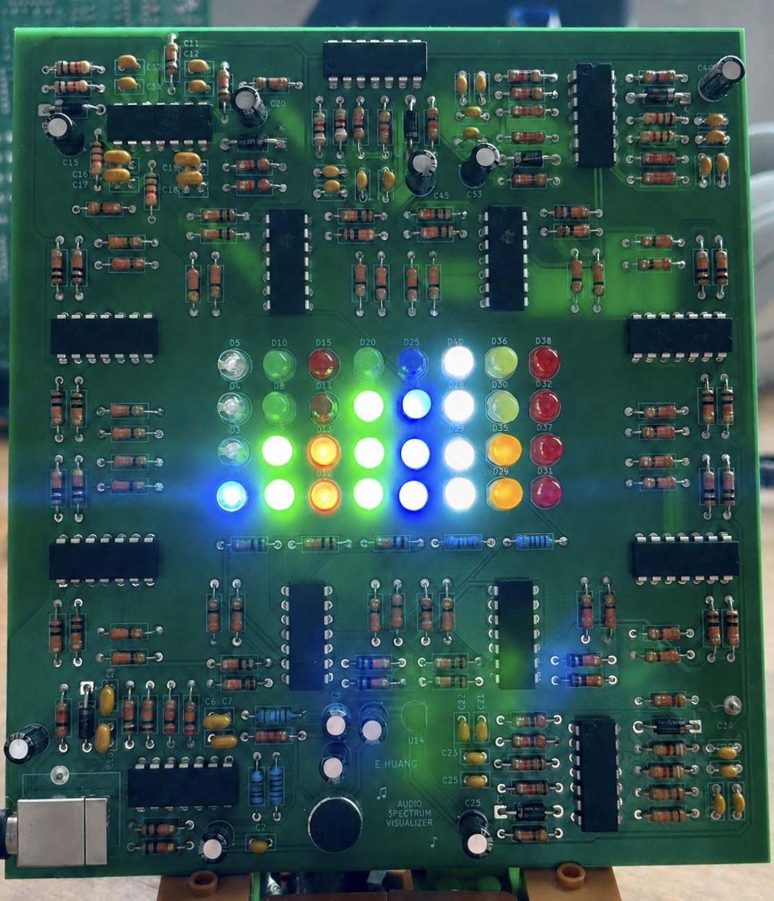
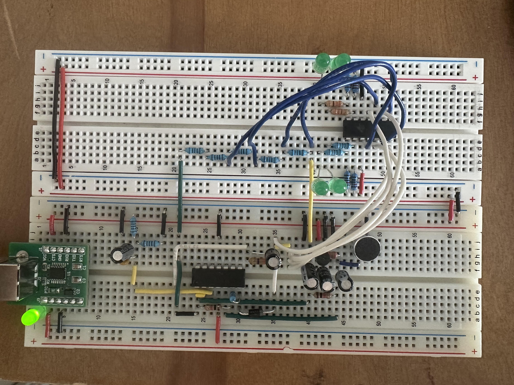
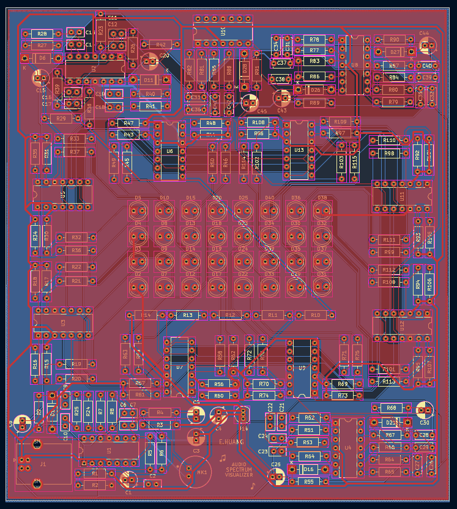
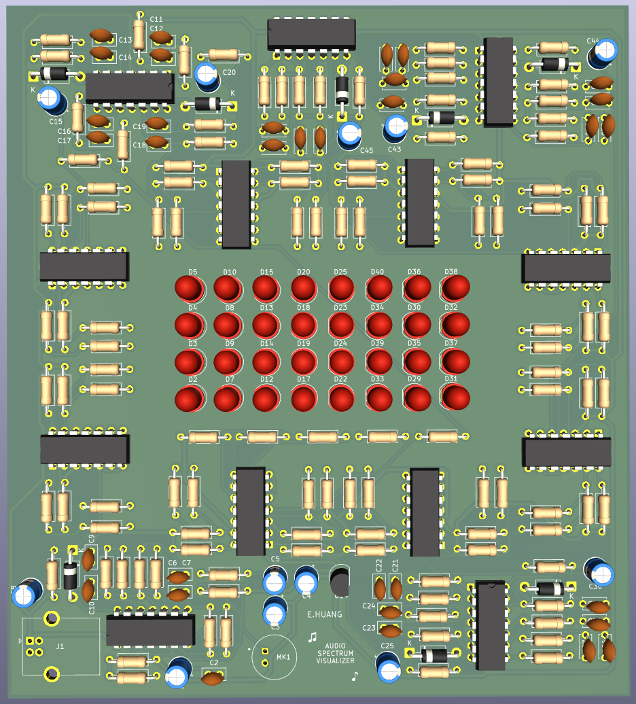
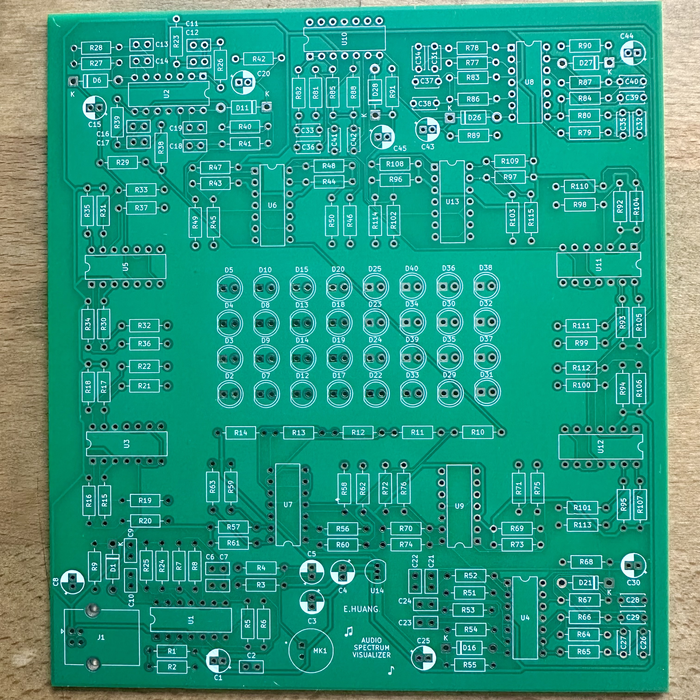
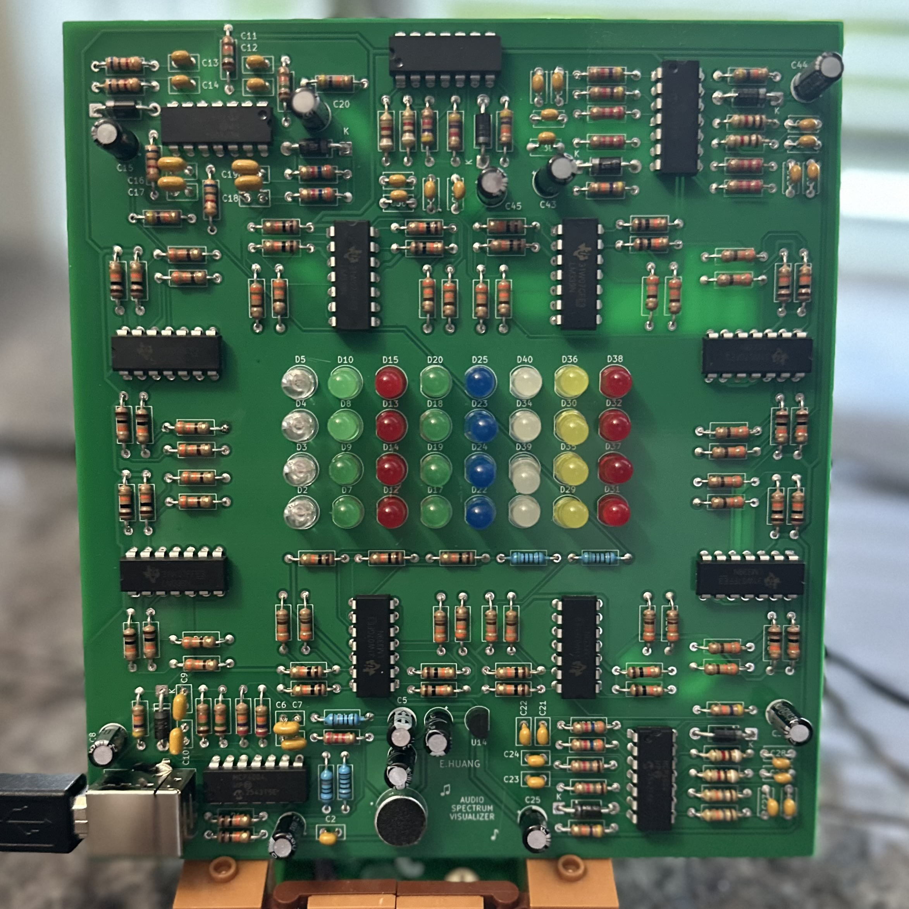

# Analog Audio Processing & Visualization PCB

A custom analog audio spectrum analyzer PCB that processes microphone audio across 8 frequency bands and displays signal intensity using 4-level LED indicators.

  

## Overview

The system captures audio through an electret microphone, amplifies the signal, separates it into 8 frequency bands using active filters, and displays the signal intensity through LED indicators.

**System Chain:**

Microphone → Preamp → 8-Band Filters → Envelope Detection → Comparators → LED Visualization

## Features

- 8 frequency bands spanning approximately 80 Hz – 10 kHz
- Cascaded Sallen-Key active filters for improved frequency separation
- Microphone preamplification for low-level audio signals
- Envelope detection to convert AC audio signals into DC levels
- 4-level LED intensity indication for each frequency band using comparators
- USB 5 V single-supply
- Custom PCB designed and assembled in KiCad

## Frequency Bands

| Band | Centre Frequency |
|---|---:|
| 1 | 80 Hz |
| 2 | 160 Hz |
| 3 | 320 Hz |
| 4 | 640 Hz |
| 5 | 1.25 kHz |
| 6 | 2.5 kHz |
| 7 | 5 kHz |
| 8 | 10 kHz |

## Filter Design

The initial design used passive filters, but were redesigned using cascaded Sallen-Key active filters to achieve greater roll-off and band separation.

  

### Sallen-Key Bandpass Filter Calculations

Each frequency band consists of a cascaded 2nd order Sallen-Key High Pass Filter (HPF) and Low Pass Filter (LPF).

**Assumptions:**
- $R_1 = R_2 = R$
- $C_1 = C_2 = C$
- $C = 100\text{nF}$ (Bands 1-4), $C = 10\text{nF}$ (Bands 5-8)

The cutoff frequencies are spaced by $\sqrt{2}$ from the centre frequency.

$$f_H = f_0 \times \sqrt{2}$$

$$f_L = \frac{f_0}{\sqrt{2}}$$

The general Sallen-Key cutoff frequency formula before simplification is:

$$f = \frac{1}{2\pi\sqrt{R_1 R_2 C_1 C_2}}$$

Applying the assumptions $R_1 = R_2 = R$ and $C_1 = C_2 = C$, this simplifies to:

$$f = \frac{1}{2\pi RC}$$

Rearranging for $R$:

$$R = \frac{1}{2\pi f C}$$

---

### Band 4 Example (Centre frequency: 640Hz)

**Step 1: Calculate HPF cutoff frequency**

$$f_L = \frac{f_0}{\sqrt{2}} = \frac{640}{\sqrt{2}} = 453\text{Hz}$$

**Step 2: Calculate LPF cutoff frequency**

$$f_H = f_0 \times \sqrt{2} = 640 \times \sqrt{2} = 905\text{Hz}$$

**Step 3: Calculate HPF resistor value ($C = 100\text{nF}$)**

$$R_{HPF} = \frac{1}{2\pi \times 453 \times 100 \times 10^{-9}} = 3513\Omega \approx 3.6\text{k}\Omega$$

**Step 4: Calculate LPF resistor value ($C = 100\text{nF}$)**

$$R_{LPF} = \frac{1}{2\pi \times 905 \times 100 \times 10^{-9}} = 1759\Omega \approx 1.8\text{k}\Omega$$

---

### Filter Band Summary

| Band | Centre Frequency | C | HPF Cutoff | HPF R | LPF Cutoff | LPF R |
|------|-----------------|---|------------|-------|------------|-------|
| 1 | 80Hz | 100nF | 56.6Hz | 27kΩ | 113Hz | 15kΩ |
| 2 | 160Hz | 100nF | 113Hz | 15kΩ | 226Hz | 6.8kΩ |
| 3 | 320Hz | 100nF | 226Hz | 6.8kΩ | 453Hz | 3.6kΩ |
| 4 | 640Hz | 100nF | 453Hz | 3.6kΩ | 905Hz | 1.8kΩ |
| 5 | 1.25kHz | 10nF | 884Hz | 18kΩ | 1.77kHz | 9.1kΩ |
| 6 | 2.5kHz | 10nF | 1.77kHz | 9.1kΩ | 3.54kHz | 4.7kΩ |
| 7 | 5kHz | 10nF | 3.54kHz | 4.7kΩ | 7.07kHz | 2.2kΩ |
| 8 | 10kHz | 10nF | 7.07kHz | 2.2kΩ | 14.1kHz | 1.1kΩ |

## Hardware

### Power

The circuit operates from a 5 V USB supply. Since audio signals oscillate about a center point, a virtual ground of 2.5V is used to allow the analog signal stages to operate from a single supply.

  

### Microphone & Preamplifier

A CMA-4544PF-W electret microphone captures the incoming audio signal, which is amplified using an MCP6004 op-amp to provide a suitable signal level for the filter stages.

The CMA-4544PF-W was chosen because its frequency response of 20Hz-20kHz covers the full audio spectrum.

  

### Envelope Detection

Each filtered signal passes through an envelope detector to convert the AC waveform into a varying DC voltage proportional to its amplitude.

  

The RC time constant determines the decay time of the envelope:

$$\tau = R \times C = 47\text{k}\Omega \times 4.7\mu\text{F} = 221\text{ms}$$

This gives a smooth, natural decay that visually tracks the music without flickering too fast or responding too sluggishly.

### Comparator & LED Stage

Comparator circuits divide each detected signal into four amplitude thresholds. The resulting outputs drive four LEDs per frequency band to provide a 4-level visualization of audio intensity.

## Prototyping & Testing

Individual circuit stages were first tested on breadboards and simulated in Multisim before PCB fabrication.

  

This iterative testing helped identify design issues before fabrication and reduced the need for PCB rework.

## PCB Design

The validated circuit was translated into a custom PCB using KiCad, with component placement, routing, and ground pours optimized for a compact and reliable layout.

  

### 3D PCB View

  

### Schematic

The full schematic is available in the repository as a KiCad schematic file

## Results

The completed PCB successfully processes audio through the 8 frequency bands and provides visual feedback through the LED array.

  
  

## Design Challenges & Iterations

### Passive → Active Filter Redesign

The original passive filter approach did not provide sufficient frequency separation. Sallen-Key active filters were implemented to improve roll-off and isolation between adjacent bands.

### Gain Optimization

The preamplifier gain was iteratively adjusted during breadboard testing to provide sufficient signal amplitude without excessive amplification of noise.

### Single-Supply Operation

Because the circuit operates from a 5 V USB supply, a virtual ground was implemented to allow the op-amp stages to process audio signals within the available supply range.
